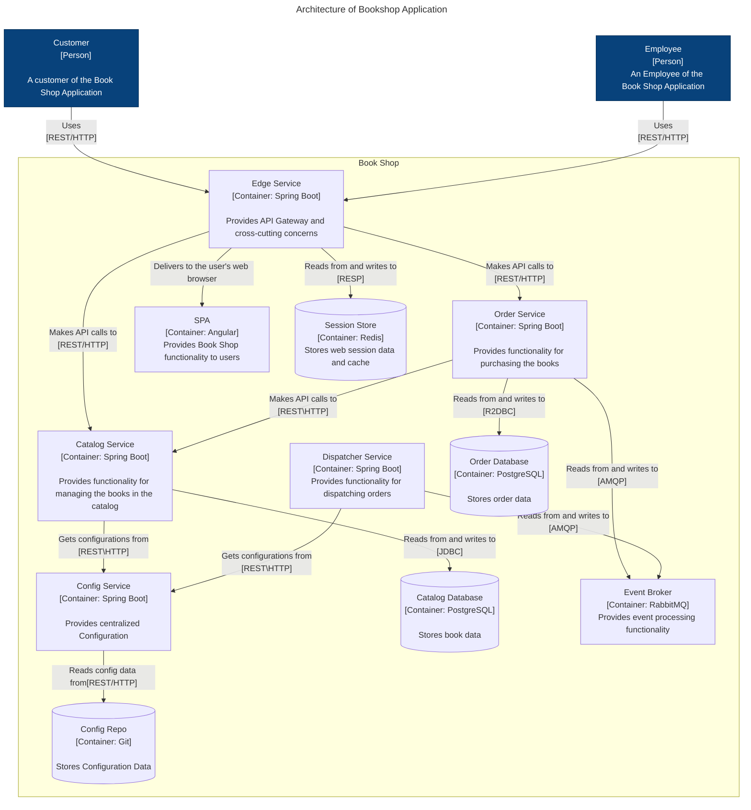
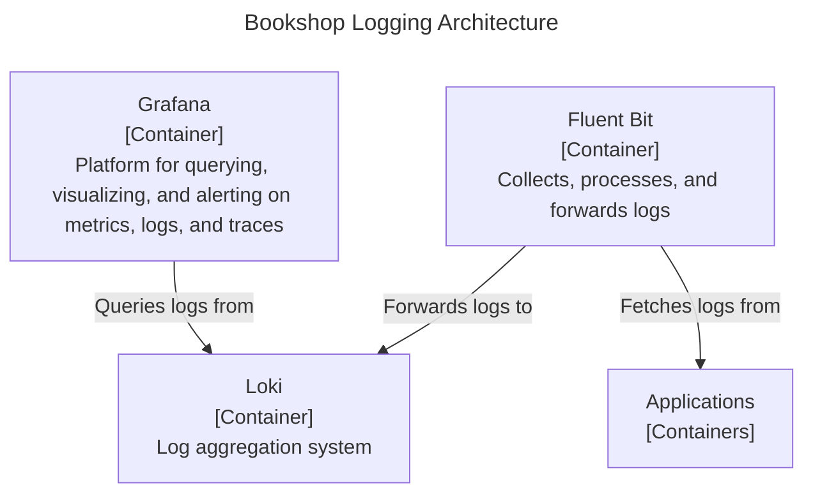
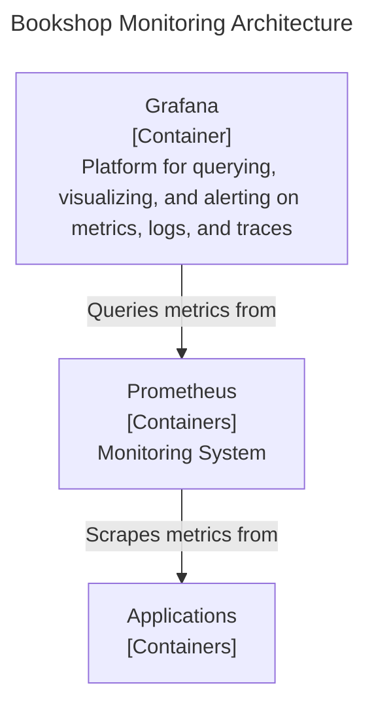
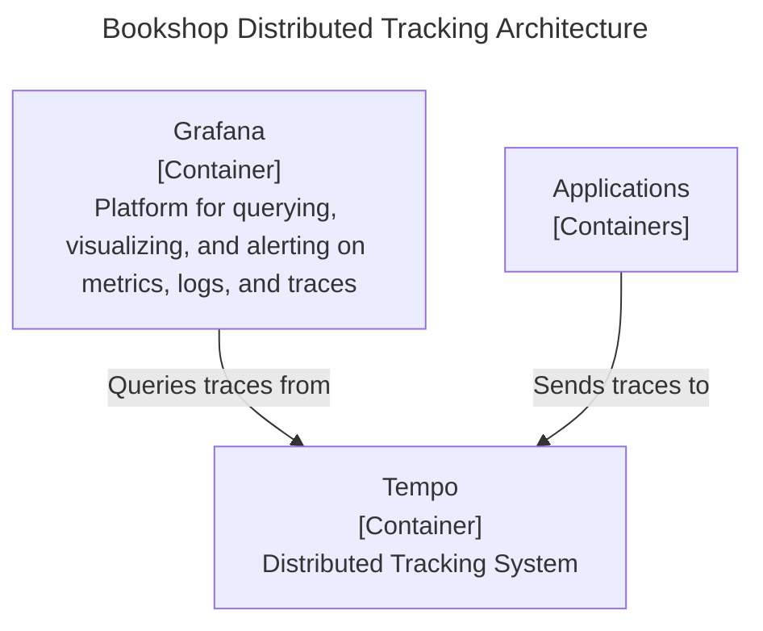

## Architecture of BookShop Application

```mermaid
---
title: "Architecture of Bookshop Application" 
---

flowchart

Customer["Customer
    [Person]

A customer of the Book Shop Application"]

Employee["Employee
    [Person]
    An Employee of the Book Shop Application"]

subgraph BS [Book Shop]

ES["Edge Service
[Container: Spring Boot]

Provides API Gateway and cross-cutting concerns"]

CS["Catalog Service
[Container: Spring Boot]

Provides functionality for managing the books in the catalog"]

OS["Order Service
[Container: Spring Boot]

Provides functionality for purchasing the books"]

DS["Dispatcher Service
[Container: Spring Boot]
Provides functionality for dispatching orders"]

SPA["SPA
[Container: Angular]
Provides Book Shop functionality to users"]

CnS["Config Service
[Container: Spring Boot]

Provides centralized Configuration"] 

CnRepo[("Config Repo
[Container: Git]

Stores Configuration Data
")]

OD[("Order Database
[Container: PostgreSQL]

Stores order data")]

CD[("Catalog Database
[Container: PostgreSQL]

Stores book data")]

EB["Event Broker
[Container: RabbitMQ]
Provides event processing functionality"]

SS[("Session Store
[Container: Redis]
Stores web session data and cache")]
end

Customer-- "Uses\n[REST/HTTP]" -->ES
Employee-- "Uses\n[REST/HTTP]" -->ES

ES-- "Delivers to the user's web browser" -->SPA
ES-- "Makes API calls to\n[REST/HTTP]" -->CS
ES-- "Makes API calls to\n[REST/HTTP]" -->OS
ES-- "Reads from and writes to\n[RESP]" --> SS

CS-- "Reads from and writes to\n[JDBC]" -->CD
CS-- "Gets configurations from\n[REST\HTTP]" -->CnS

CnS-- "Reads config data from[REST/HTTP]" --> CnRepo

OS-- "Reads from and writes to\n[R2DBC]" -->OD
OS-- "Reads from and writes to\n[AMQP]" -->EB
OS-- "Makes API calls to\n[REST\HTTP]" -->CS

DS-- "Gets configurations from\n[REST\HTTP]" -->CnS
DS-- "Reads from and writes to\n[AMQP]" -->EB


classDef person fill:#08427b,stroke:#052e56,color:#ffffff
class Customer,Employee person


```

## Logging Architecture of Bookshop Application

```mermaid
---
title: Bookshop Logging Architecture
---

flowchart
    
App["Applications
[Containers]
"]

FB["Fluent Bit
[Container]
Collects, processes, and forwards logs"]

Loki["Loki
[Container]
Log aggregation system"]

GF["Grafana
[Container]
Platform for querying, visualizing, and alerting on metrics, logs, and traces"]

GF -- "Queries logs from" --> Loki
FB --"Forwards logs to" --> Loki
FB --"Fetches logs from" --> App
```

## Monitoring Architecture of Bookshop Application

```mermaid
---
title: Bookshop Monitoring Architecture
---
flowchart
    
GF["Grafana
[Container]
Platform for querying, visualizing, and alerting on metrics, logs, and traces"]

App["Applications
[Containers]
"]

P["Prometheus
[Containers]
Monitoring System
"]

P --"Scrapes metrics from" --> App
GF --"Queries metrics from" --> P

```

## Distributed Tracing Architecture

```mermaid
---
title: Bookshop Distributed Tracking Architecture
---

flowchart

GF["Grafana
[Container]
Platform for querying, visualizing, and alerting on metrics, logs, and traces"]

App["Applications
[Containers]
"]

T["Tempo
[Container]
Distributed Tracking System"]

GF-- "Queries traces from" --> T
App-- "Sends traces to" --> T
    
```

