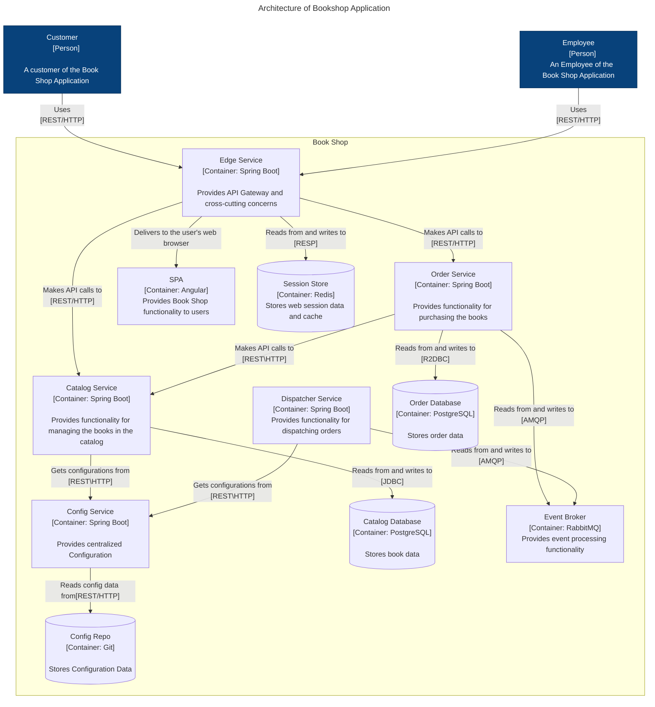
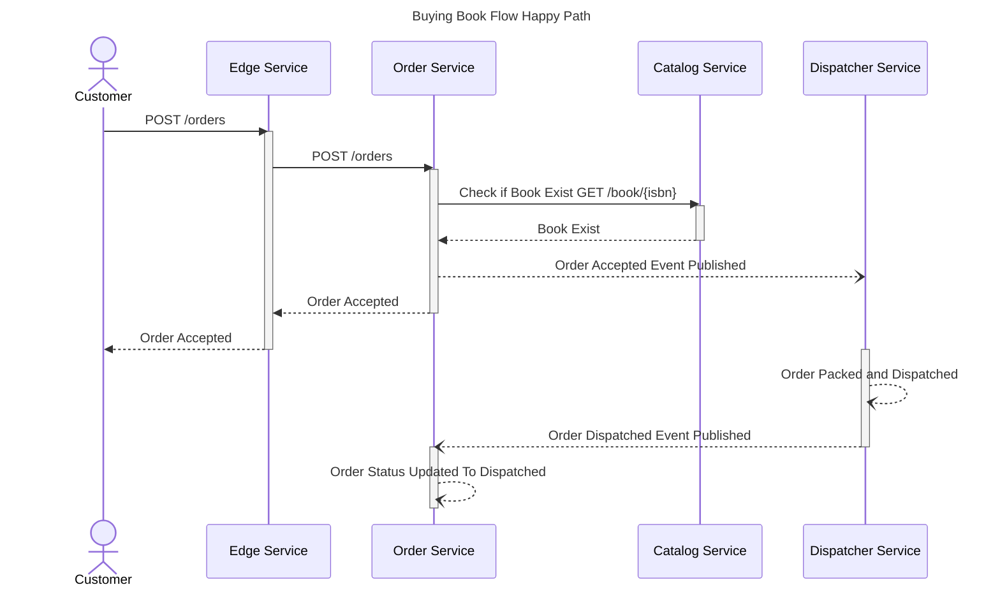
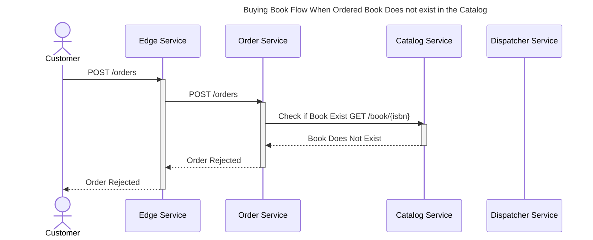
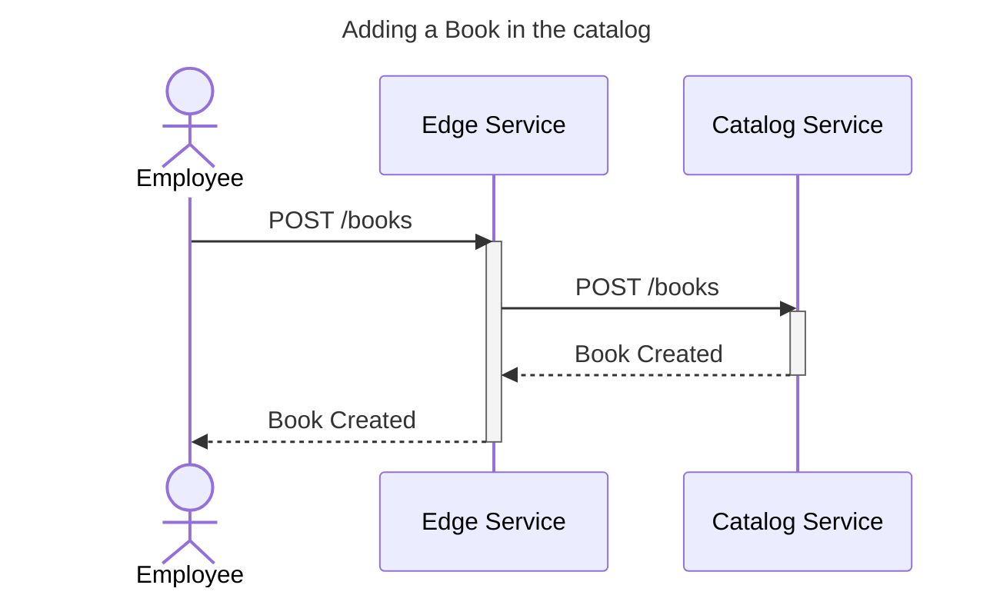
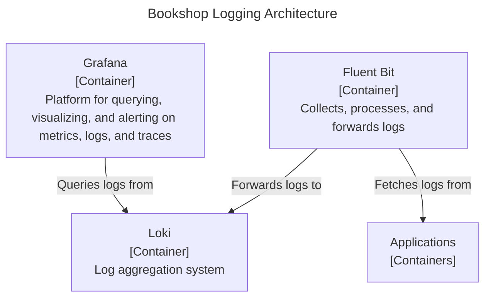
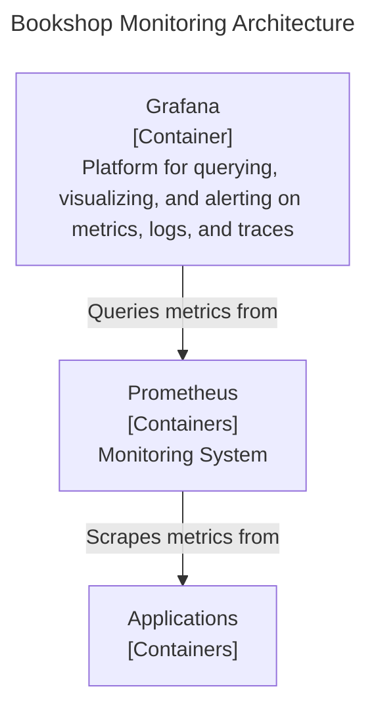
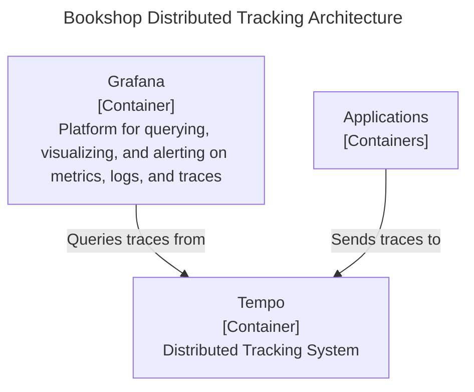

## Architecture of BookShop Application

## Sequence Diagram of Buying a Book Flow Happy Path

## Sequence Diagram of Buying a Book Flow When Ordered Book Does not exist in the Catalog

## Sequence Diagram of Adding a Book in the catalog

## Logging Architecture of Bookshop Application

## Monitoring Architecture of Bookshop Application

## Distributed Tracing Architecture

